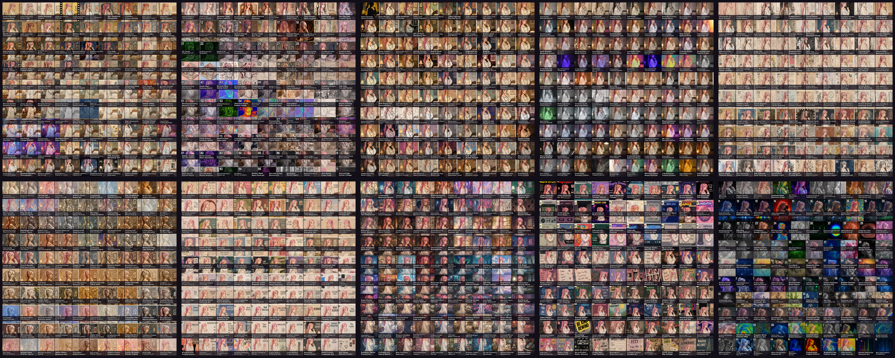

# GPT Work Mono

Shared artifacts and supporting utilities created in GPT Work.

## Style atlas

[`assets/style-atlas/`](assets/style-atlas/) contains ten labeled 10×10 contact sheets with 1,000 new visual style concepts created as an extension to the 397-style Clio preview library.

- 10 PNG sheets at 3000×3000 px
- 100 cards per sheet
- fixed 300×300 px cells
- JSON and CSV coordinate manifests
- a Pillow slicer that exports all 1,000 cards

